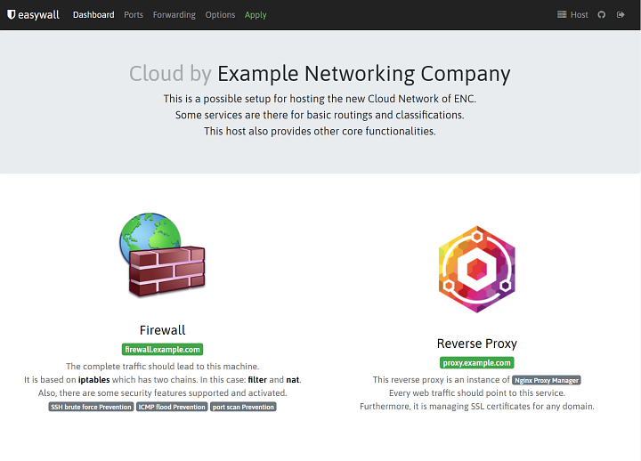

  

## New Connections
- **Docker Support**
- **OpenVPN Support**

## New Features
- **Network interfaces** - can be assigned and used as an additional requirement of a rule.
- **Extended Open Ports** - limits an open port by a network interface and/or a source host/ip.
- **IP Forwarding** - has the ability to set a destination host/ip.
- **Dashboard** - is an possible overview of available services, apps and so on...
- **Navigation** - Hide unused menu items.

   
  

---

### Orignal Description

**Firewalls** are becoming increasingly important in today's world. Hackers and automated scripts are constantly trying to **invade your system** and use it for Bitcoin mining, botnets or other things.

To prevent these attacks, you can use a firewall on your system. **IPTables** is the strongest firewall in Linux because it can **filter packets in the kernel** before they reach the application. Using IPTables is **not very easy** for Linux beginners. We have created easywall - the simple **IPTables web interface**. The focus of the software is on easy installation and use.

### Features

- **Built-in rules** - that can be activated by option.
- **Logging** - of blocked connections and many other stuff.
- **IPv6** - is completely supported since it should be used on every system.
- **Two step activation** - Changed rules are activated in two steps to check the connection.
- **Blacklisting and Whitelisting** - of IP addresses and IPv6 addresses.
- **Port Forewarding** - Forward Ports through the Firewall.
- **TCP, UDP and Port Ranges** - Open them if you need them in the internet.
- **Own IPTables rules** - Can be managed in the web interface.
- **Install and Update** - The software can be installed and updated easily.
- **Ansible role** - For advanced users and automation.

## License

easywall is GNU General Public License v3.0 +.
